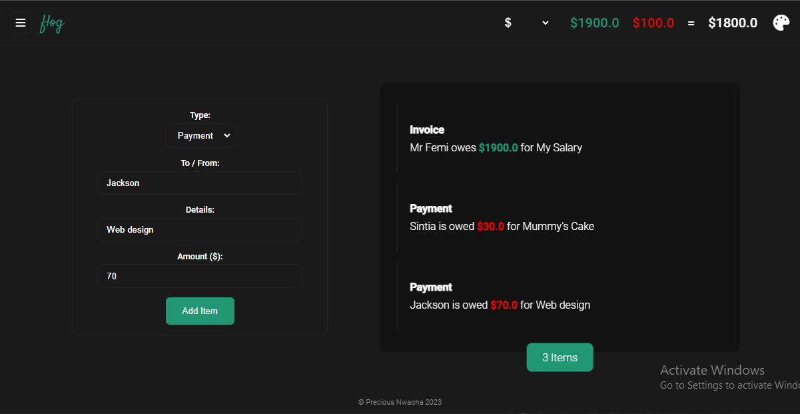

# Flog

### Finance Logger

### Table of Content

- [Description](#description)
- [Technologies](#technologies)
- [Installation](#installation)
- [Usage](#usage)
- [Documentation](#documentation)
- [Roadmap](#roadmap)
- [Project Status](#project-status)
- [Source](#source)
- [License](#license)


### **Description**

This web app allows users to keep track of their finances in form of logs. Thy can manage invoices and payouts from a single page. It also uses a currency API to allow users from different regions to use their local currency.

### Illustrations



### **Technologies**

- Typescript
- Currency API
- HTML
- CSS

### **Installation**

You need to have Node.js you can install it [here](https://hardhat.org/tutorial/setting-up-the-environment.html).

Make sure you have typescript installed in your computer, to check run:

```bash
tsc --version
```

If you don’t see a version number, run to install typescript:

```bash
npm install -g typescript
```

in the projects root directory, run to start the ts compiler:

```bash
tsc -w
```

Go life, and that’s it 🚀.

### Features

- Easily add Invoices and Payouts with Neat UI
- Theming (Dark, Light and Modular)
- Switch bwtween Currencies
- View Realtime currency rating
- User Data Storage

### ****Usage****

It’s pretty easy to use, just visit [the Flog website](http://floger.netlify.app) 

### **Roadmap**

This projects has different phases:

1. Build basic application functionality in Typescript.
2. UI/UX Design & Code the UI
3. Add Data Storage and Theming
4. Integrate Currency API
5. Deploy
6. Updates and Maintenance

### **Contributing**

By all means, we would be pleased to have contributors, and there are no requirements for now. Just bring whatever value.
- Fork this repository;
- Create a branch with your feature: `git checkout -b my-feature`;
- Commit your changes: `git commit -m "feat: my new feature"`;
- Push to your branch: `git push origin my-feature`.

Once your pull request has been merged, you can delete your branch.

### **Project status**

Phase:  The project has being deployed 🚀. We are at phase 6.

It is been maintained by preciousnwaoha.

Pending Update: Cashflow visualization.

### Sources **acknowledgment**

This app was inspired by the [NetNinja](http://NetNinja.co)’s typescript course.

Contributors:

| Name | Role | Github |
| --- | --- | --- |
| Nwaoha Precious | Every Part | https://github.com/preciousnwaoha  |

### **License**

MIT
